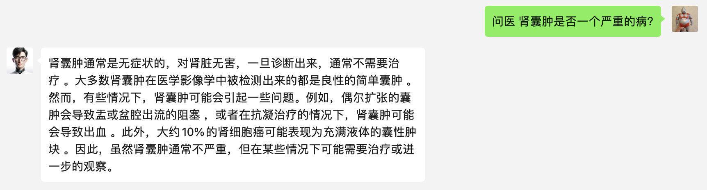
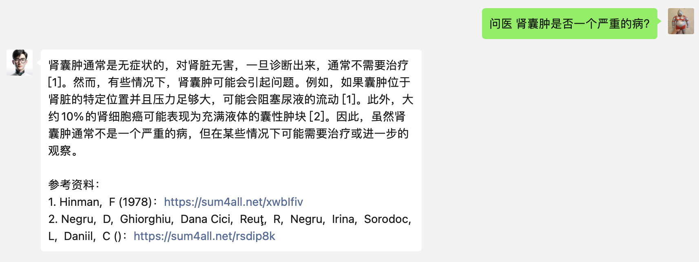

## 用户交流
[telegram频道 ](https://sum4all.site/telegram)

## 友情赞助
<a href="https://www.buymeacoffee.com/fatwang2" target="_blank"></a>

## 更新日志
- V0.0.2，20240119，支持显示引用文献，默认不显示，可自行修改配置文件
- V0.0.1，20240118，发布第一版，支持单论对话

## 简介
本项目为微信插件，需配合[chatgpt-on-wechat](https://github.com/zhayujie/chatgpt-on-wechat)项目使用

## 功能
- 支持医疗相关问题专业解答
- 支持显示回答引用的专业资料



## 申请服务
点击[medisearch](https://search2ai.online/medisearch)注册，获取key，免费1000次，后续每个请求 $0.2

## 配置
- 服务器部署：复制插件目录的`config.json.template`文件,重命名为`config.json`，配置参数即可
- docker部署：参考项目docker部署的插件使用，`config.json`内增加sum4all插件的配置参数，操作见 [docker插件配置](https://github.com/zhayujie/chatgpt-on-wechat#3-%E6%8F%92%E4%BB%B6%E4%BD%BF%E7%94%A8)

配置文件含义如下：
```
"medisearch_key": API key
"prefix": 触发前缀词，命中即可触发本插件的回复
"show_details"：是否显示本回答引用的医疗文献，默认false，如需了解详情可配置为true
```

## 后续计划
- 支持多轮对话
- 支持更多医疗大模型